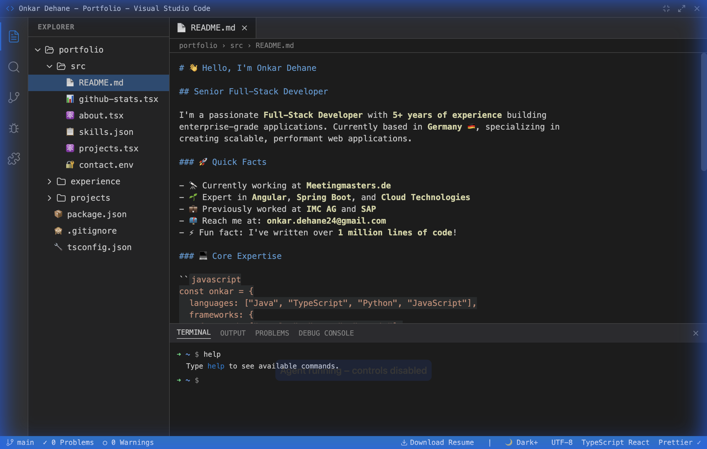

# VS Code Portfolio

A personal portfolio website built with React and Next.js, designed to look and feel like Visual Studio Code.



## 🚀 Features

- **Interactive Terminal**: A fully functional terminal with command history and custom commands (`help`, `about`, `projects`, `contact`, `clear`).
- **Dynamic File System**: Navigate through folders and files in the Explorer sidebar. Files open in tabs just like in VS Code.
- **Live GitHub Stats**: Fetches real-time data (stars, repos, followers) from the GitHub API.
- **Theming System**: Switch between **Dark**, **Light**, and **Monokai** themes.
- **Syntax Highlighting**: Code files (`.tsx`, `.json`, `.md`) are rendered with syntax highlighting matching the active theme.
- **Mobile Responsive**: Fully responsive design with a hamburger menu for mobile devices.
- **Keyboard Shortcuts**: Use `Ctrl+Shift+P` (or `Cmd+Shift+P`) to toggle the command palette (visual only for now).

## 🛠️ Tech Stack

- **Framework**: [Next.js](https://nextjs.org/)
- **Library**: [React](https://reactjs.org/)
- **Styling**: [Tailwind CSS](https://tailwindcss.com/)
- **Icons**: [Lucide React](https://lucide.dev/)
- **State Management**: React Context API (`FileSystemContext`, `ThemeContext`)

## 🏃‍♂️ Getting Started

1.  **Clone the repository**
    ```bash
    git clone https://github.com/onkardehane/vscode-portfolio.git
    cd vscode-portfolio
    ```

2.  **Install dependencies**
    ```bash
    npm install
    ```

3.  **Run the development server**
    ```bash
    npm run dev
    ```

4.  **Open your browser**
    Navigate to [http://localhost:3000](http://localhost:3000)

## 🎮 Terminal Commands

Type `help` in the terminal to see the list of available commands:

- `about`: Display information about me.
- `projects`: List featured projects.
- `contact`: Show contact information.
- `clear`: Clear the terminal history.

## 🎨 Themes

Click the theme toggle in the Status Bar (bottom right) to switch between:
- Dark+ (Visual Studio)
- Light+ (Visual Studio)
- Monokai

## 📱 Mobile Support

The application is optimized for mobile devices. The sidebar collapses into a hamburger menu to maximize screen space for the editor and terminal.

---

Built with ❤️ by [Onkar Dehane](https://github.com/onkardehane)
